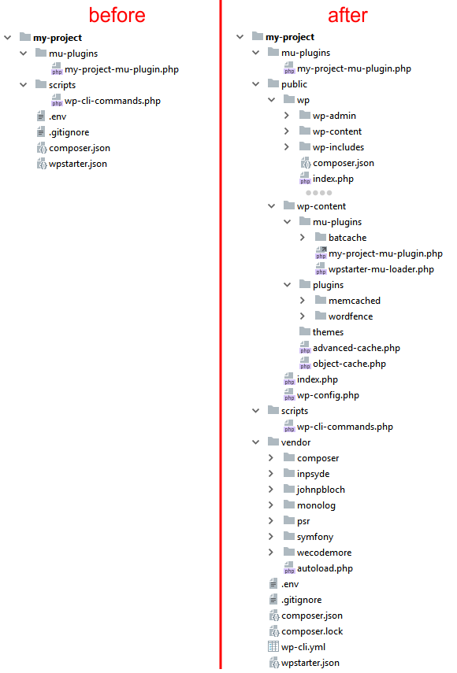
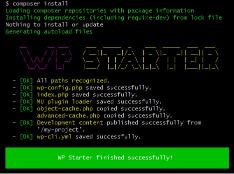

# A Commented Sample `composer.json`

Below there’s a sample `composer.json` not very different from what can be used in real world for a WP Starter powered website:

```json
{
  "name": "my-company/my-project",
  "type": "project",
  "license": "proprietary",
  "repositories": [
    {
      "type": "composer",
      "url": "https://wpackagist.org"
    }
  ],
  "require": {
    "composer/installers": "^1.6",
    "wecodemore/wpstarter": "^3",
    "johnpbloch/wordpress": "4.9",
    "inpsyde/wonolog":"^1",
    "wpackagist-plugin/wordfence":">=7.1.14",
    "wpackagist-plugin/memcached":"3.0.*",
    "frc/batcache": "1.3.*"
  },
  "extra": {
    "wordpress-install-dir": "public/wp",
    "wordpress-content-dir": "public/wp-content",
    "installer-paths":       {
      "public/wp-content/plugins/{$name}": [
        "type:wordpress-plugin"
      ],
      "public/wp-content/mu-plugins/{$name}": [
        "type:wordpress-muplugin"
      ],
      "public/wp-content/themes/{$name}": [
        "type:wordpress-theme"
      ],
      "public/wp-content/{$name}": [
        "type:wordpress-dropin"
      ]
    }
  }
}
```

For readability sake, WP Starter specific configuration will be placed in separate `wpstarter.json` file that could look like this:

```json
{
  "register-theme-folder": true,
  "content-dev-dir": "./",
  "dropins": [
    "./public/wp-content/plugins/memcached/object-cache.php",
    "./public/wp-content/mu-plugins/batcache/advanced-cache.php"
  ],
  "wp-cli-commands": "./scripts/wp-cli-commands.php"
}
```

But the exact same configuration could have been placed in a **`extra.wpstarter`** object in `composer.json` with exact same result.


## `composer.json` step by step

`"name"`, `"type"`, and `"license"` root properties of `composer.json` are basic Composer settings so not specific to WP Starter at all. Please refer to [Composer documentation](https://getcomposer.org/doc/) if not familiar with it. 

### Repositories

In the sample `composer.json` we used [`"repositories"`](https://getcomposer.org/doc/05-repositories.md) setting to tell Composer to use [WordPress Packagist](https://wpackagist.org/). This is a free Composer repository (maintained by [Outlandish](http://outlandish.com/)) that exposes plugins and themes available on the official [wp.org](https://wordpress.org/) repository as Composer packages.

The official Composer repository, [Packagist](https://packagist.org/), is already checked by Composer, so there's no need to add it.

### Require

[`require`](https://getcomposer.org/doc/01-basic-usage.md#the-require-key) section of  `composer.json` is where we tell Composer what packages we need, and in which version.

[**`"composer/installers"`**](http://composer.github.io/installers/) is a Composer plugin that provides custom installers for application or framework specific files. In our case, requiring this package we ensure WordPress plugins and themes packages will be placed in the target wp-content folder instead of in the standard "vendor" folder.

**`"wecodemore/wpstarter"`** is the present package.

The two packages above are the only two required packages in a WP Starter powered website.

[**`"johnpbloch/wordpress"`**](https://packagist.org/packages/johnpbloch/wordpress) is an unofficial WordPress package maintained by [John P. Bloch](https://johnpbloch.com/). Even if this is not required, nor is the only way to put WordPress core on the project, this is by far the more common way (with its 2.5M+ downloads) to deal with core installations in projects managed by Composer.

The package is actually no more than a "wrapper" package to provide two different packages: the `wordpress-core` that provides no more than WordPress core code (with just an added `composer.json`) and a `wordpress-core-intaller` that is an installer Composer plugin that tells Composer where to place WordPress core files and folders.

[**`"inpsyde/wonolog"`**](https://inpsyde.github.io/Wonolog/) is just an example of a library (not a plugin) that we might want to add to our website. Because it is available on Packagist we just add it to requirements... and that's it. It depends on other dependencies, who maybe depends on others... Composer will recursively discover the dependencies and install everything for us.

[**`"wpackagist-plugin/wordfence"`**](https://wordpress.org/plugins/wordfence/) is an example of a plugin we might want to add to our website. This plugin does not support Composer. But we can require it via *WordPress Packagist*, because we have included that in our  `"repositories"` setting.

[**"wpackagist-plugin/memcached"**](https://wordpress.org/plugins/memcached/) is another plugin that we can add via *WordPress Packagist*. It has been added here as example of a special case. In fact, this plugin is not really a plugin, but a **dropin**. By reading [install instruction](https://wordpress.org/plugins/memcached/#installation) they say that after plugin installation we need to *"Copy object-cache.php to wp-content"*, but WP Starter can do that for us, we'll see soon how.

[**`"frc/batcache"`**](https://packagist.org/packages/frc/batcache) is a plugin that is available on Packagist, so it is easily required. However, it represents another special case. Looking at its [source](https://github.com/frc/batcache) it contains both a **MU plugin** ([`batcache.php`](https://github.com/frc/batcache/blob/frc/batcache.php)) and a **dropin** ([`advanced-cache.php`](https://github.com/frc/batcache/blob/frc/advanced-cache.php)). We will see how with a very minimum configuration WP Starter will handle it perfectly, placing everything in the right place without any manual intervention nor custom scripts.

### Extra

`extra` is the `composer.json` that Composer reserves for Composer plugins configuration. And that is exactly what we using it for: providing configuration for the 3 plugins we have:

- WP core installer
- WP Starter
- Composer installers

#### WP core installer configuration

WP core installer is an "installer plugin". It tells Composer where to place the packages of type `"wordpress-core"`, that are not supported by Composer installers. By default the plugin tells Composer to install WordPress in the `./wordpress` directory, but provides the **`extra.wordpress-install-dir`** to customize it.

In our sample, we are telling to place WP in the folder `public/wp`, because having a "public" folder and WordPress folder in it, will enable us to use `./public/` as webroot and **place the `.env` file inside the *project* root, so outside of webroot, and that's very recommended for security reasons**.

#### WP content configuration

WP content folder is *indirectly* defined by the setting we use for plugin and themes via `"extra.installer-paths"` path (more on this below). E.g. if we tell Composer to put plugins in `./wp-content/plugins` we are *implying* that `./wp-content` is the content folder.

However, WP Starter needs the content folder to be explicitly declared.

The way we inform WP Starter about the location of WP content folder is  **`extra.wordpress-content-dir`** setting that is designed to be symmetrical to `wordpress-install-dir` and so placed outside `extra.wpstarter` that is where all the other WP Starter settings resides.

#### Composer Installers configuration

We are requiring Composer Installers to allow WordPress plugins, themes, MU plugins, and dropins to be placed inside WP content folder instead of default vendor folder.

By default Composer Installers tells Composer to place those WordPress-related packages in the `/wp-content` folder inside the project root folder.

However, that does not work for us: both because as described above we are customizing the content folder (placing it outside of WP core folder) and because we are also customizing WP core folder.

Luckily, Composer Installers supports configuration via the **`"extra.installer-paths"`** entry. See [documentation](https://github.com/composer/installers#custom-install-paths).

Basically, with the configuration in our sample file we are telling Composer Installers to place:

- packages of type `"wordpress-plugin"` in the folder `./public/wp-content/plugins/{$name}/`, where `$name` will be replaced by the package *name*, e.g. *"wordfence"* for `wpackagist-plugin/wordfence` (where *"wpackagist-plugin"* is the *vendor*);
- packages of type  `"wordpress-muplugin"` in the folder `./public/wp-content/muplugins/{$name}/`;
- packages of type `"wordpress-theme"` in the folder `./public/wp-content/themes/{$name}/`
- packages of type `"wordpress-dropin"` in the folder `./public/wp-content/{$name}/`

It worth noting that while this setup works for plugins and themes, which are recognized by WordPress in subfolders of  `wp-content/plugins` and `wp-content/themes` respectively, it does **not** work out of the box for MU plugins and dropins: MU plugins needs to be *directly* inside `wp-content/mu-plugins/` (no subfolders) and dropins needs to be  *directly* inside `wp-content/`.

WP Starter handles this issue for us. The `MuLoaderStep` takes care of creating a "loader" MU plugin responsible to load MU plugins that Composer placed in subfolders of `wp-content/mu-plugins`, and the `DropinsStep` takes care of moving the dropin files Composer placed in subfolders of `wp-content` directly into `wp-content`.

However, even that will not work for the package `"wpackagist-plugin/memcached"` because this is a *dropin*, even if its type says `"wordpress-plugin"` (due to the fact the WP official repository only supports plugins and themes and not MU plugins nor dropins). We will see how to fix this with a single line of configuration in our `wpstarter.json`.

Moreover, it is _partially_ working for `"frc/batcache"`, in fact this package contains both a *MU plugin* and a *dropin*, and its package type says `"wordpress-muplugin"`, which means that for the provided MU plugin file we are setup, but for the dropin we need another line of configuration in our `wpstarter.json`.


## WP Starter specific configuration

 **`"extra.wpstarter"`** is the place for all the WP Starter configuration. However, WP Starter supports also a separate **`wpstarter.json`** file located at project root, and that is what we are using in our sample.

The chapter *"Configuration"* has a detailed explanation on how that works and there's also a *"Settings Cheat Sheet"* chapter that lists all the available settings.

Below there is the a step by step explanation of just the settings used in the sample `wpstarter.json` we are using in sample in this chapter.

### `register-theme-folder`

In our `require` section of the sample `composer.json` there are no themes. Even if we are using the WordPress package that ships with default (Twenty*) themes, our WP installation would normally not *see* those, because we are using a different WP content folder. WordPress has a function, [`register_theme_directory`](https://developer.wordpress.org/reference/functions/register_theme_directory/) that can be used to tell WordPress to look for themes in a custom folder (additionally to the default theme folder).

When the `register-theme-folder` setting is set to `true`, like in our sample, the `wp-config.php` generated by WP Starter will contain a call to that function that will register as theme directory the folder where default themes are located, so that WordPress can find it and we don't need to install any theme to make the site work.

### `content-dev-dir`

*"WP Starter Steps"* chapter has a detailed explanation of what "development content" means in WP Starter.

Basically, those are themes, plugins, MU plugins, and dropins that are placed in the same repository of the project, but are kept outside of WP content directory because that contains 3rd party dependencies and having those in separate folder makes VCS handling easier.

By default WP Starter expects those files and folders to be placed in a `./content-dev` folder inside root. By setting `content-dev-dir` to `"./"` we are telling WP Starter that the "development content" parent folder is project root.

Which means, for example, that any plugin files and folders inside `./plugins` will be symlinked at `./public/wp-content/plugins` where WordPress will found them. Same goes for themes, MU plugins and dropins.

### `dropins`

It has been said above how the package  `"wpackagist-plugin/memcached"` we are requiring, having the type `"wordpress-plugin"`, will be placed in the folder `./public/wp-content/plugins/memcached/`. However, what that package actually contains is a dropin that should be moved directly into `./public/wp-content/`.

It has also been said above how the package `"frc/batcache"`, whose type is `"wordpress-muplugin"`, will be placed in `./public/wp-content/mu-plugins/batcache/` and that works for the MU plugin file it actually ships (thanks to the loader WP Starter automatically creates), but not for the dropin file the package also provides.

The `dropins` settings in our `wpstarter.json` sample is an array of dropin file paths that WP Starter has to place in the proper folder. By simply listing the source paths WP Starter will know what to do, and everything will be setup without any additional script or manual intervention.

### `wp-cli-commands`

There's an entire documentation chapter, *"Running WP CLI Commands",* that explains the ins and outs of running WP CLI commands via WP Starter (and why it might be worth to do it) .

So we are not going to explain the purpose of `wp-cli-commands` again here, we can just say that the file located at `./scripts/wp-cli-commands.php` will return an array of commands to be passed to WP CLI.


## A look at the folder structure

By looking at the sample `composer.json` above, we can guess what could be a possible folder structure of the project _before_ and *after* Composer and WP Starter runs:



*(most of files in WP root has been removed for readability sake)*

In between, there's WP Starter running with this output:



*(Composer says "Nothing to install" because, for readability, this is the output when everything is installed)*

When WP Starter finished, if webroot is correctly pointing to `./public`, and the `.env` file contains the necessary DB configuration, then there's nothing else we need to do to make it work.


------

| *Prev*                                     |                                                   *Next* |
| ------------------------------------------ | -------------------------------------------------------: |
| [WP Starter Steps](05-WP-Starter-Steps.md) | [Running WP CLI Commands](07-Running-WP-CLI-Commands.md) |